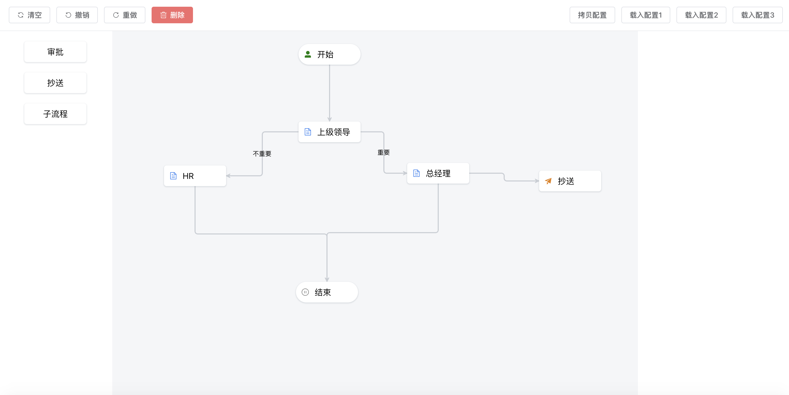

# vue workflow desinger

基于vue3 + jsplump的工作流设计器

# 功能

- [x] 初始化数据

- [x] 节点编辑

- [x] 线标签编辑

- [x] 支持画布拖拽

- [x] 连接线标记和标记编辑

- [x]  边界保护

- [x]  撤销

- [ ]  自动排序

- [x]  清空数据

- [x]  连线编辑

- [ ]  流程检测

- [ ]  连线校验

# screenshot

</img>

